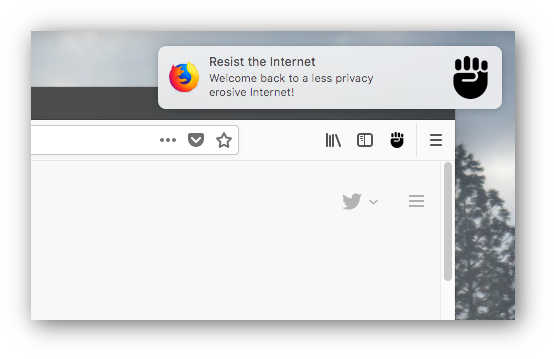
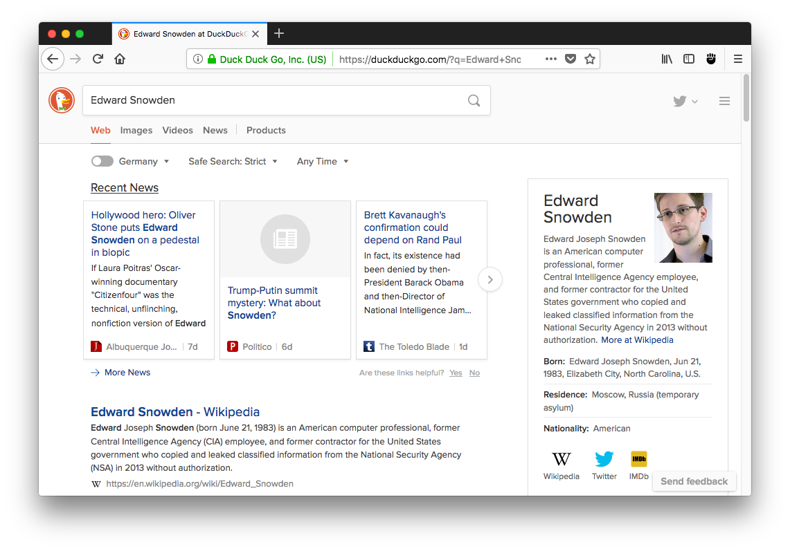
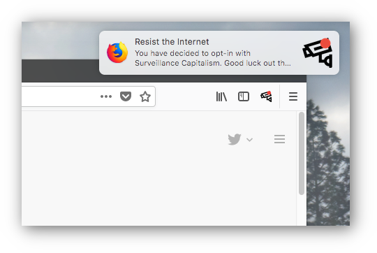

# Resist the Internet

*Relax, this project is just a joke.*

This is a browser extension that forces you away from Surveillance Capitalist
websites and to more privacy-preserving alternatives instead. If you try to open
Twitter you will get to Mastodon instead. If you try to open Google Maps you
will get to OpenStreetMap. If you try to open Google Search you will end up on
DuckDuckGo. If someone sends you a Google Maps or a Google Search link, the
search query will be automated translated for OpenStreetMap and DuckDuckGo
respectively.

You can also optionally turn it off by clicking on the toolbar icon...

## Install

Visit:

https://addons.mozilla.org/en-US/firefox/addon/resist-the-internet/

## Credits

This project is licensed with GPL v3.0 and is copyrighted by Claudio Guarnieri.

Surveillance camera icon by Vectors Market from the Noun Project.
Fist icon by Andrew Doane from the Noun Project.
